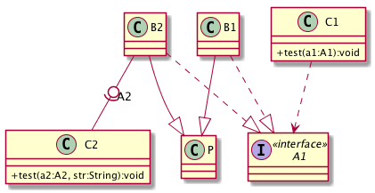
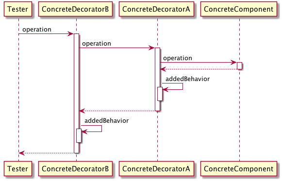
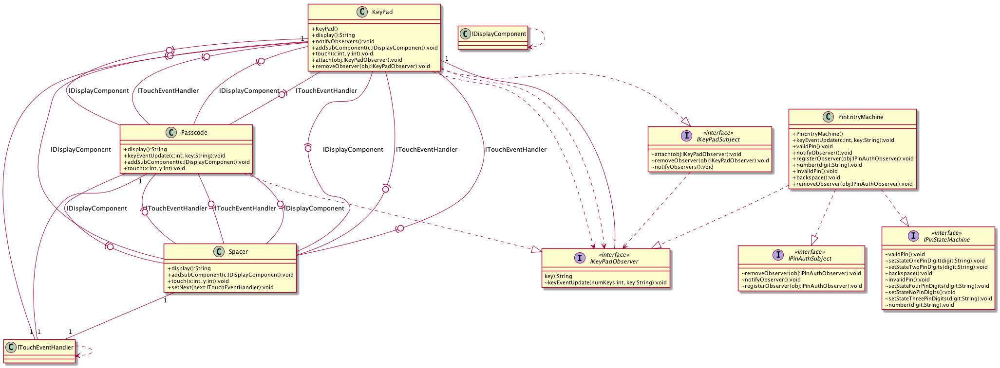

# UMLparser
UML parser that parse java source codes and generate class diagrams and sequence diagrams

- sample class diagram output 1:

    

- sample sequence diagram output:

    

- sample class diagram output 2:
	

